<html xmlns:v="urn:schemas-microsoft-com:vml" xmlns:o="urn:schemas-microsoft-com:office:office" xmlns:w="urn:schemas-microsoft-com:office:word" xmlns:m="http://schemas.microsoft.com/office/2004/12/omml" xmlns="http://www.w3.org/TR/REC-html40"><head><meta http-equiv="Content-Type" content="text/html; charset=UTF-16LE">

</head>

<body lang="EN-US" link="blue" vlink="purple" style="tab-interval:.5in">

<h1>Hacker's Guide to Q&amp;A Visualization<o:p></o:p></h1>

Data Science and
visualization is about 90% data wrangling but that's no fun and, besides, we
only have 24 hours to build something great.<o:p></o:p>

This guide is built to get
you to great because, let's face it, the judges won't be impressed by your
awesome ETL code no matter how important that is.<o:p></o:p>

<h2 id="Hacker&#39;sGuidetoQ&amp;AVisualization-Thisguidehas2parts(toolsanddata)butnotinthatorder">This
guide has 2 parts (tools and data) but not in that order&nbsp;<!--[if gte vml 1]><v:shapetype id="_x0000_t75"
 coordsize="21600,21600" o:spt="75" o:preferrelative="t" path="m@4@5l@4@11@9@11@9@5xe"
 filled="f" stroked="f">
 <v:stroke joinstyle="miter"/>
 <v:formulas>
  <v:f eqn="if lineDrawn pixelLineWidth 0"/>
  <v:f eqn="sum @0 1 0"/>
  <v:f eqn="sum 0 0 @1"/>
  <v:f eqn="prod @2 1 2"/>
  <v:f eqn="prod @3 21600 pixelWidth"/>
  <v:f eqn="prod @3 21600 pixelHeight"/>
  <v:f eqn="sum @0 0 1"/>
  <v:f eqn="prod @6 1 2"/>
  <v:f eqn="prod @7 21600 pixelWidth"/>
  <v:f eqn="sum @8 21600 0"/>
  <v:f eqn="prod @7 21600 pixelHeight"/>
  <v:f eqn="sum @10 21600 0"/>
 </v:formulas>
 <v:path o:extrusionok="f" gradientshapeok="t" o:connecttype="rect"/>
 <o:lock v:ext="edit" aspectratio="t"/>
</v:shapetype><v:shape id="Picture_x0020_1" o:spid="_x0000_i1045" type="#_x0000_t75"
 alt="(wink)" style='width:12pt;height:12pt;visibility:visible;
 mso-wrap-style:square'>
 <v:imagedata src="Hacker's+Guide+to+Q&amp;A+Visualization_files/image001.png"
  o:title="(wink)"/>
</v:shape><![endif]--><!--[if !vml]--><!--[endif]--><o:p></o:p></h2>

The intention is to give you
sufficient understanding, some tools to get you started and to describe the
data you'll be working with. 
Remember that, except for the data section, it's just advice. Feel free to use
the tools you know and love and go as far off the rails as you need to...it
would not be hacking if you didn't.<o:p></o:p>

<h1 id="Hacker&#39;sGuidetoQ&amp;AVisualization-Data">Data<o:p></o:p></h1>

The data for this challenge
was extracted from a wickedly complicated database (eGain)
and lovingly, winnowed and massaged into the simple schema below:<o:p></o:p>

<!--[if gte vml 1]><v:shape
 id="Picture_x0020_2" o:spid="_x0000_i1044" type="#_x0000_t75" style='width:351pt;
 height:3in;visibility:visible;mso-wrap-style:square'>
 <v:imagedata src="Hacker's+Guide+to+Q&amp;A+Visualization_files/image002.png"
  o:title="3d8a5271016e501abc68c94a653a4a6b"/>
</v:shape><![endif]--><!--[if !vml]-->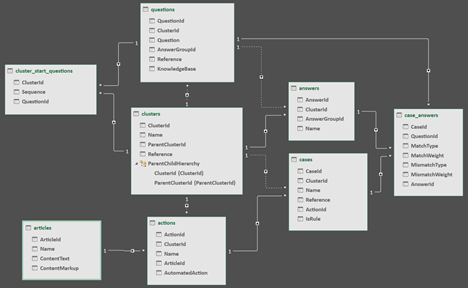<!--[endif]--><o:p></o:p>

In order
to ensure the
broadest participation possible (business users, data scientists and software
developers), I've published the data in three formats:<o:p></o:p>

<ol start="1" type="1">
 <li class="MsoNormal" style="mso-margin-top-alt:auto;margin-bottom:12.0pt;
     mso-list:l8 level1 lfo1;tab-stops:list .5in">Multi-tabbed
     Excel File - If you are an expert with PowerPivot, Power BI, Tableau or
     other tools this format is very handy 
      
     <a href="https://lexisai-hackathon.s3.amazonaws.com/med-malpractice-knowledge-graph/cardiovascular-medicine.xlsx">https://lexisai-hackathon.s3.amazonaws.com/med-malpractice-knowledge-graph/cardiovascular-medicine.xlsx</a><o:p></o:p></li>
 <li class="MsoNormal" style="mso-margin-top-alt:auto;margin-bottom:12.0pt;
     mso-list:l8 level1 lfo1;tab-stops:list .5in">JSON or
     CSV - Work with ElasticSearch, NoSql or
     JavaScript visualization libraries, JSON is your friend.&nbsp; More of an IPython, Pandas or command line sort of gal, CSV is
     your ticket: 
      
     <a href="https://lexisai-hackathon.s3.amazonaws.com/med-malpractice-knowledge-graph/cardiovascular-medicine-json.zip">https://lexisai-hackathon.s3.amazonaws.com/med-malpractice-knowledge-graph/cardiovascular-medicine-json.zip</a> 
     <a href="https://lexisai-hackathon.s3.amazonaws.com/med-malpractice-knowledge-graph/cardiovascular-medicine-csv.zip">https://lexisai-hackathon.s3.amazonaws.com/med-malpractice-knowledge-graph/cardiovascular-medicine-csv.zip</a><o:p></o:p></li>
 <li class="MsoNormal" style="mso-margin-top-alt:auto;mso-margin-bottom-alt:auto;
     mso-list:l8 level1 lfo1;tab-stops:list .5in">SQLite -
     For my fellow full-stack development brothers and sisters, we have a db file that runs in the venerable and mighty
     in-memory RDBMs: 
      
     <a href="https://lexisai-hackathon.s3.amazonaws.com/med-malpractice-knowledge-graph/cardiovascular-medicine.db">https://lexisai-hackathon.s3.amazonaws.com/med-malpractice-knowledge-graph/cardiovascular-medicine.db</a><o:p></o:p></li>
</ol>

We'll touch on some of the
tools you can use to bend this data to your will in the sections below.<o:p></o:p>

<h2 id="Hacker&#39;sGuidetoQ&amp;AVisualization-What&#39;sinthesetablesanyway?">What's
in these tables anyway?<o:p></o:p></h2>

First, it's important to
point out that the datasets contains content for two
product areas:<o:p></o:p>

<ol start="1" type="1">
 <li class="MsoNormal" style="mso-margin-top-alt:auto;mso-margin-bottom-alt:auto;
     mso-list:l6 level1 lfo2;tab-stops:list .5in">Standard
     of Care Content (“SOC”)<o:p></o:p></li>
 <li class="MsoNormal" style="mso-margin-top-alt:auto;mso-margin-bottom-alt:auto;
     mso-list:l6 level1 lfo2;tab-stops:list .5in">Case
     Value Assessment (“CVA”)<o:p></o:p></li>
</ol>

Also, the dataset covers
cardiovascular medicine and is a focused subset of our entire corpus which
covers a huge range of medical practice areas.<o:p></o:p>

Our business sponsors are
primarily interested in seeing what we can do with the SOC so that's what we'll
focus on here.<o:p></o:p>

However, by
all means feel free to build something spectacular with the CVA data as
well (it's a little more involved though).<o:p></o:p>

Let's start with a simple excercise to map of the data to the UI so you get a better
feel of how things are connected.<o:p></o:p>

Examples are in SQL but you
can slice and dice in Pandas or other favorite tool too (just examples).<o:p></o:p>

<h3 id="Hacker&#39;sGuidetoQ&amp;AVisualization-TheClustersTable:">The
Clusters Table:<o:p></o:p></h3>

The clusters table is in the
middle of the diagram and referenced by most tables because it is the starting
point and glue for the Q&amp;A Knowledge Graph.<o:p></o:p>

It defines medical subject
areas, starting points for Q&amp;A sections like the topics entry page:<o:p></o:p>

<!--[if gte vml 1]><v:shape
 id="Picture_x0020_3" o:spid="_x0000_i1043" type="#_x0000_t75" style='width:351pt;
 height:258pt;visibility:visible;mso-wrap-style:square'>
 <v:imagedata src="Hacker's+Guide+to+Q&amp;A+Visualization_files/image004.png"
  o:title="81ee836a46a9b268c1f0c8342611d170"/>
</v:shape><![endif]--><!--[if !vml]-->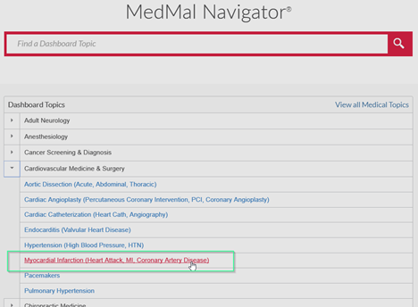<!--[endif]--><o:p></o:p>

It has a parent/child hierachy and when you do a hierarchical query (or graph vizualization&nbsp;<!--[if gte vml 1]><v:shape
 id="Picture_x0020_4" o:spid="_x0000_i1042" type="#_x0000_t75" alt="(smile)"
 style='width:12pt;height:12pt;visibility:visible;mso-wrap-style:square'>
 <v:imagedata src="Hacker's+Guide+to+Q&amp;A+Visualization_files/image006.png"
  o:title="(smile)"/>
</v:shape><![endif]--><!--[if !vml]--><!--[endif]-->&nbsp;)&nbsp;you get something like
this:<o:p></o:p>

<!--[if gte vml 1]><v:shape
 id="Picture_x0020_5" o:spid="_x0000_i1041" type="#_x0000_t75" style='width:351pt;
 height:401.25pt;visibility:visible;mso-wrap-style:square'>
 <v:imagedata src="Hacker's+Guide+to+Q&amp;A+Visualization_files/image007.png"
  o:title="3615ab88317ca30e2a03473a37f623e7"/>
</v:shape><![endif]--><!--[if !vml]-->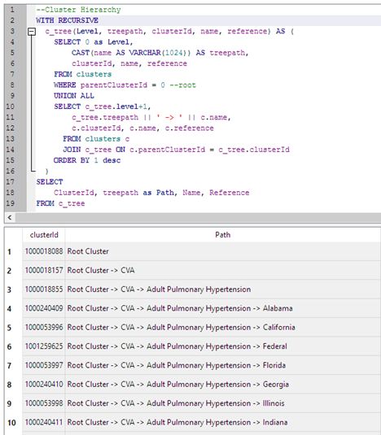<!--[endif]--><o:p></o:p>

For SOC (clusterId
=&nbsp;<strong>1000018158</strong>)
in our dataset we get this:<o:p></o:p>

"<strong>1000018158</strong>"
"SOC" "SOC" "C2" 
... 
"1000019343" "SOC -&gt; Hypertension"
"Hypertension" "C10" 
<strong>"1000019341"
"SOC -&gt; Myocardial Infarction" "Myocardial Infarction"
"C8"</strong><o:p></o:p>

And, as you can see, this is
the Breadcrumb Heading in the screenshot below.<o:p></o:p>

&nbsp;<o:p></o:p>

<!--[if gte vml 1]><v:shape
 id="Picture_x0020_6" o:spid="_x0000_i1040" type="#_x0000_t75" style='width:351pt;
 height:353.25pt;visibility:visible;mso-wrap-style:square'>
 <v:imagedata src="Hacker's+Guide+to+Q&amp;A+Visualization_files/image009.jpg"
  o:title="988eef9b1d6befa2c9a975e44f49eb69"/>
</v:shape><![endif]--><!--[if !vml]-->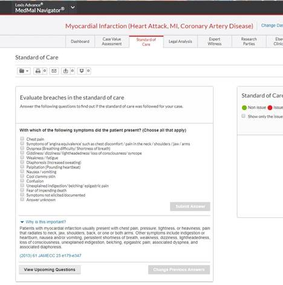<!--[endif]--><o:p></o:p>

This screenshot is a step in
the Standard of Care Questionnaire with the goal of finding "deviations in
the standard of care".<o:p></o:p>

And shows a question,
possible answers/responses to those questions and "Why is this
important?" with useful guidance.<o:p></o:p>

<h3 id="Hacker&#39;sGuidetoQ&amp;AVisualization-TheQuestionsTable:">The
Questions Table:<o:p></o:p></h3>

Ok, so what question should
I ask first?&nbsp; For SOC, it is very simple, questions are anchored by ClusterId (1000019341 for
Myocardial Infarction) and are asked in order.<o:p></o:p>

<!--[if gte vml 1]><v:shape
 id="Picture_x0020_7" o:spid="_x0000_i1039" type="#_x0000_t75" style='width:351pt;
 height:99pt;visibility:visible;mso-wrap-style:square'>
 <v:imagedata src="Hacker's+Guide+to+Q&amp;A+Visualization_files/image011.png"
  o:title="295388953d9ca350ba3ef4d3c5189bf0"/>
</v:shape><![endif]--><!--[if !vml]-->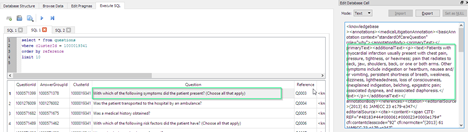<!--[endif]--><o:p></o:p>

<h3 id="Hacker&#39;sGuidetoQ&amp;AVisualization-TheAnswersTable:">The
Answers Table:<o:p></o:p></h3>

Questions are tied to
answers in a few ways but for SOC you can simply join the questions table to
the answers table on answerGroupId and you are good
to go.<o:p></o:p>

<!--[if gte vml 1]><v:shape
 id="Picture_x0020_8" o:spid="_x0000_i1038" type="#_x0000_t75" style='width:351pt;
 height:149.25pt;visibility:visible;mso-wrap-style:square'>
 <v:imagedata src="Hacker's+Guide+to+Q&amp;A+Visualization_files/image013.png"
  o:title="f1d329dc16f9d558dd5812b31cfa87bc"/>
</v:shape><![endif]--><!--[if !vml]-->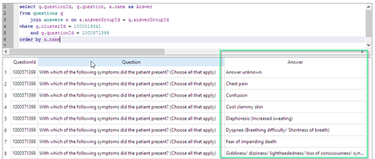<!--[endif]--><o:p></o:p>

<h3 id="Hacker&#39;sGuidetoQ&amp;AVisualization-The&quot;ClusterStartQuestions&quot;Table:">The
"Cluster Start Questions" Table:<o:p></o:p></h3>

This structure is used to
bootstrap a Q&amp;A dialog.<o:p></o:p>

When you select a Medical Topic the application will want to know what sort of
analysis you want to do.&nbsp; In the case, a SOC or CVA analysis?<o:p></o:p>

SOC is straigtforward,
you'll need this table only if you are working with CVA visualizations.<o:p></o:p>

<!--[if gte vml 1]><v:shape
 id="Picture_x0020_9" o:spid="_x0000_i1037" type="#_x0000_t75" style='width:351pt;
 height:147pt;visibility:visible;mso-wrap-style:square'>
 <v:imagedata src="Hacker's+Guide+to+Q&amp;A+Visualization_files/image015.png"
  o:title="b81ddb3d942b2c1b41c5444dc73c7f48"/>
</v:shape><![endif]--><!--[if !vml]-->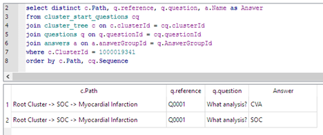<!--[endif]--><o:p></o:p>

SOC tables discussed at a
glance...<o:p></o:p>

<table class="MsoNormalTable" border="1" cellspacing="0" cellpadding="0" width="76%" style="width:76.46%;border-collapse:collapse;border:none;mso-border-alt:solid windowtext .75pt;
 mso-yfti-tbllook:1184">
 <colgroup><col style="width: 17.3675%;"><col style="width: 72.7937%;"></colgroup>
 <tbody><tr style="mso-yfti-irow:0;mso-yfti-firstrow:yes">
  <td style="border:solid windowtext 1.0pt;mso-border-alt:solid windowtext .75pt;
  padding:3.75pt 3.75pt 3.75pt 3.75pt">
  
<b>Table
  Logical Name<o:p></o:p></b>

  </td>
  <td style="border:solid windowtext 1.0pt;border-left:none;mso-border-left-alt:
  solid windowtext .75pt;mso-border-alt:solid windowtext .75pt;padding:3.75pt 3.75pt 3.75pt 3.75pt">
  
<b>Description<o:p></o:p></b>

  </td>
 </tr>
 <tr style="mso-yfti-irow:1;page-break-inside:avoid">
  <td style="border:solid windowtext 1.0pt;border-top:none;mso-border-top-alt:
  solid windowtext .75pt;mso-border-alt:solid windowtext .75pt;padding:3.75pt 3.75pt 3.75pt 3.75pt">
  
Clusters<o:p></o:p>

  </td>
  <td style="border-top:none;border-left:none;border-bottom:solid windowtext 1.0pt;
  border-right:solid windowtext 1.0pt;mso-border-top-alt:solid windowtext .75pt;
  mso-border-left-alt:solid windowtext .75pt;mso-border-alt:solid windowtext .75pt;
  padding:3.75pt 3.75pt 3.75pt 3.75pt">
  
Contains medical topics at their highest level. It is
  essentially the folder that houses the questions, answers, and
  annotations.&nbsp;<o:p></o:p>

  </td>
 </tr>
 <tr style="mso-yfti-irow:2;page-break-inside:avoid">
  <td style="border:solid windowtext 1.0pt;border-top:none;mso-border-top-alt:
  solid windowtext .75pt;mso-border-alt:solid windowtext .75pt;padding:3.75pt 3.75pt 3.75pt 3.75pt">
  
Questions<o:p></o:p>

  </td>
  <td style="border-top:none;border-left:none;border-bottom:solid windowtext 1.0pt;
  border-right:solid windowtext 1.0pt;mso-border-top-alt:solid windowtext .75pt;
  mso-border-left-alt:solid windowtext .75pt;mso-border-alt:solid windowtext .75pt;
  padding:3.75pt 3.75pt 3.75pt 3.75pt">
  
Contains the Questions and the “Why is this important?”
  annotations and their hyperlink/jcite link to Lexis
  content.&nbsp;<o:p></o:p>

  </td>
 </tr>
 <tr style="mso-yfti-irow:3;page-break-inside:avoid">
  <td style="border:solid windowtext 1.0pt;border-top:none;mso-border-top-alt:
  solid windowtext .75pt;mso-border-alt:solid windowtext .75pt;padding:3.75pt 3.75pt 3.75pt 3.75pt">
  
Answers<o:p></o:p>

  </td>
  <td style="border-top:none;border-left:none;border-bottom:solid windowtext 1.0pt;
  border-right:solid windowtext 1.0pt;mso-border-top-alt:solid windowtext .75pt;
  mso-border-left-alt:solid windowtext .75pt;mso-border-alt:solid windowtext .75pt;
  padding:3.75pt 3.75pt 3.75pt 3.75pt">
  
Contains all of the possible
  answers users can select to the questions<o:p></o:p>

  </td>
 </tr>
 <tr style="mso-yfti-irow:4;page-break-inside:avoid">
  <td style="border:solid windowtext 1.0pt;border-top:none;mso-border-top-alt:
  solid windowtext .75pt;mso-border-alt:solid windowtext .75pt;padding:3.75pt 3.75pt 3.75pt 3.75pt">
  
Case Answers<o:p></o:p>

  </td>
  <td style="border-top:none;border-left:none;border-bottom:solid windowtext 1.0pt;
  border-right:solid windowtext 1.0pt;mso-border-top-alt:solid windowtext .75pt;
  mso-border-left-alt:solid windowtext .75pt;mso-border-alt:solid windowtext .75pt;
  padding:3.75pt 3.75pt 3.75pt 3.75pt">
  
Contains the weighting that determines whether an answer
  will be a red light (Issue) or a green light (non-issue)<o:p></o:p>

  </td>
 </tr>
 <tr style="mso-yfti-irow:5;mso-yfti-lastrow:yes;page-break-inside:avoid">
  <td style="border:solid windowtext 1.0pt;border-top:none;mso-border-top-alt:
  solid windowtext .75pt;mso-border-alt:solid windowtext .75pt;padding:3.75pt 3.75pt 3.75pt 3.75pt">
  
Cluster Start Questions<o:p></o:p>

  </td>
  <td style="border-top:none;border-left:none;border-bottom:solid windowtext 1.0pt;
  border-right:solid windowtext 1.0pt;mso-border-top-alt:solid windowtext .75pt;
  mso-border-left-alt:solid windowtext .75pt;mso-border-alt:solid windowtext .75pt;
  padding:3.75pt 3.75pt 3.75pt 3.75pt">
  
Bootstraps a Q&amp;A flow for various types of analysis<o:p></o:p>

  </td>
 </tr>
</tbody></table>

<h1 id="Hacker&#39;sGuidetoQ&amp;AVisualization-Tools">Tools<o:p></o:p></h1>

The tools in this section
are generally divided into these categories:<o:p></o:p>

<ol start="1" type="1">
 <li class="MsoNormal" style="mso-margin-top-alt:auto;margin-bottom:12.0pt;
     mso-list:l5 level1 lfo3;tab-stops:list .5in">General
     Purpose Workspaces - General purpose data analysis, data wrangling, etc.<o:p></o:p></li>
 <li class="MsoNormal" style="mso-margin-top-alt:auto;margin-bottom:12.0pt;
     mso-list:l5 level1 lfo3;tab-stops:list .5in">Graph
     Visualization Tools Graph Databases<o:p></o:p></li>
</ol>

Note that some tools can do
"all of the above".<o:p></o:p>

With a few exceptions, I've made an effort to choose tools that:<o:p></o:p>

<ul type="disc">
 <li class="MsoNormal" style="mso-margin-top-alt:auto;mso-margin-bottom-alt:auto;
     mso-list:l3 level1 lfo4;tab-stops:list .5in">Are
     robust and work well<o:p></o:p></li>
 <li class="MsoNormal" style="mso-margin-top-alt:auto;mso-margin-bottom-alt:auto;
     mso-list:l3 level1 lfo4;tab-stops:list .5in">Are
     multi-platform (Linux, Windows, MacOS)<o:p></o:p></li>
 <li class="MsoNormal" style="mso-margin-top-alt:auto;mso-margin-bottom-alt:auto;
     mso-list:l3 level1 lfo4;tab-stops:list .5in">Are open
     source<o:p></o:p></li>
 <li class="MsoNormal" style="mso-margin-top-alt:auto;mso-margin-bottom-alt:auto;
     mso-list:l3 level1 lfo4;tab-stops:list .5in">Represent
     the spectrum of modern data science and general programming languages<o:p></o:p></li>
</ul>

I've also included some
tools and add-ins for business users and analysts to work with as well&nbsp;<!--[if gte vml 1]><v:shape id="Picture_x0020_10"
 o:spid="_x0000_i1036" type="#_x0000_t75" alt="(smile)" style='width:12pt;
 height:12pt;visibility:visible;mso-wrap-style:square'>
 <v:imagedata src="Hacker's+Guide+to+Q&amp;A+Visualization_files/image006.png"
  o:title="(smile)"/>
</v:shape><![endif]--><!--[if !vml]--><!--[endif]--><o:p></o:p>

<h3 id="Hacker&#39;sGuidetoQ&amp;AVisualization-Workspaces:">Workspaces:<o:p></o:p></h3>

<ul type="disc">
 <li class="MsoNormal" style="mso-margin-top-alt:auto;margin-bottom:12.0pt;
     mso-list:l2 level1 lfo5;tab-stops:list .5in">SQLite
     Database Browser (SQL) - The queries in this guide were authored in the
     excellent SQLite Database Browser:&nbsp;&nbsp;<a href="http://sqlitebrowser.org/">http://sqlitebrowser.org/</a><o:p></o:p></li>
 <li class="MsoNormal" style="mso-margin-top-alt:auto;margin-bottom:12.0pt;
     mso-list:l2 level1 lfo5;tab-stops:list .5in">JuPyter
     (Python) - Notebooks are invaluable these days for analysis collaboration
     and rapid prototyping.&nbsp; One of the best is JuPyter:&nbsp;<a href="http://jupyter.org/">http://jupyter.org/</a> 
      
     Here's a 1 minute guide to get you going:<o:p></o:p></li>
 <ul type="circle">
  <li class="MsoNormal" style="mso-margin-top-alt:auto;mso-margin-bottom-alt:
      auto;mso-list:l2 level2 lfo5;tab-stops:list 1.0in">Download
      Miniconda and Install Python Distribution&nbsp;<a href="http://conda.pydata.org/miniconda.html">http://conda.pydata.org/miniconda.html 
      </a><a href="http://conda.pydata.org/miniconda.html"> 
      </a><o:p></o:p></li>
  <li class="MsoNormal" style="mso-margin-top-alt:auto;mso-margin-bottom-alt:
      auto;mso-list:l2 level2 lfo5;tab-stops:list 1.0in">Install
      Core Dependencies<o:p></o:p></li>
 </ul>
</ul>

<pre style="margin-left:1.0in">C:\&gt;conda install numpy pandas scipy scikit-learn matplotlib seaborn jupyter notebook<o:p></o:p></pre>

&nbsp;<o:p></o:p>

<!--[if !supportLists]-->o&nbsp;&nbsp;&nbsp;
<!--[endif]-->Start
Jupyter - Your browser will open on&nbsp;<a href="http://localhost:8888/">http://localhost:8888 
</a><o:p></o:p>

<pre style="margin-left:1.0in">c:\&gt;md c:\data-science<o:p></o:p></pre><pre style="margin-left:1.0in">c:\&gt;cd c:\data-science<o:p></o:p></pre><pre style="margin-left:1.0in">c:\data-science&gt;jupyter notebook<o:p></o:p></pre>

&nbsp;<o:p></o:p>

<!--[if !supportLists]-->o&nbsp;&nbsp;&nbsp;
<!--[endif]-->Install
additional libraries (see below)<o:p></o:p>

&nbsp;<o:p></o:p>

<ul type="disc">
 <li class="MsoNormal" style="mso-margin-top-alt:auto;margin-bottom:12.0pt;
     mso-list:l2 level1 lfo5;tab-stops:list .5in">plot.ly
     (Python) - Don't have time to install tools?&nbsp; Want a quick
     one-stop-shop studio to work in?&nbsp; Use plot.ly:&nbsp;&nbsp;<a href="https://plot.ly/">https://plot.ly</a><o:p></o:p></li>
 <li class="MsoNormal" style="mso-margin-top-alt:auto;margin-bottom:12.0pt;
     mso-list:l2 level1 lfo5;tab-stops:list .5in">Microsoft
     Excel (WYSWIG) - Excel has come a long way and new addins
     have extended it's
     capabilities as a serious data science tool. 
      
     Enable the following add-ins and install these tools to get you going:<o:p></o:p></li>
 <ul type="circle">
  <li class="MsoNormal" style="mso-margin-top-alt:auto;mso-margin-bottom-alt:
      auto;mso-list:l2 level2 lfo5;tab-stops:list 1.0in">Power
      BI -&nbsp;<a href="https://powerbi.microsoft.com/en-us/downloads/">https://powerbi.microsoft.com/en-us/downloads/</a><o:p></o:p></li>
  <li class="MsoNormal" style="mso-margin-top-alt:auto;mso-margin-bottom-alt:
      auto;mso-list:l2 level2 lfo5;tab-stops:list 1.0in">GIGRAPH
      Network Vizualization -&nbsp;<a href="https://appsource.microsoft.com/en-us/product/office/WA104379873?tab=Overview">https://appsource.microsoft.com/en-us/product/office/WA104379873?tab=Overview</a><o:p></o:p></li>
  <li class="MsoNormal" style="mso-margin-top-alt:auto;mso-margin-bottom-alt:
      auto;mso-list:l2 level2 lfo5;tab-stops:list 1.0in">Also,
      check out the endless add-ins available for Power BI and Excel:&nbsp;<a href="https://appsource.microsoft.com/en-us/marketplace/apps?search=&amp;page=1&amp;product=power-bi-visuals&amp;category=analytics%3Bartifical-intelligence&amp;src=office">https://appsource.microsoft.com/en-us/marketplace/apps?search=&amp;page=1&amp;product=power-bi-visuals&amp;category=analytics%3Bartifical-intelligence&amp;src=office</a> 
      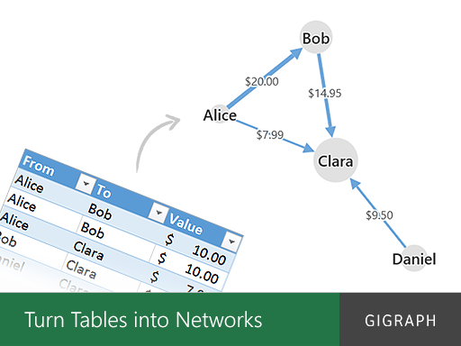<o:p></o:p></li>
 </ul>
</ul>

<h3 id="Hacker&#39;sGuidetoQ&amp;AVisualization-GraphVisualization:">Graph
Visualization:<o:p></o:p></h3>

<ul type="disc">
 <li class="MsoNormal" style="mso-margin-top-alt:auto;mso-margin-bottom-alt:auto;
     mso-list:l0 level1 lfo6;tab-stops:list .5in">Gephi
     (WYSIWG) - It's not for everyone, has learning curve (no difficult, just
     lots of options) but Gephi is an amazing
     all-in-one Graph Vizualization
     platform:&nbsp;&nbsp;<a href="https://gephi.org/">https://gephi.org/</a> 
      
     <o:p></o:p></li>
</ul>

&nbsp;<o:p></o:p>

<ul type="disc">
 <li class="MsoNormal" style="mso-margin-top-alt:auto;mso-margin-bottom-alt:auto;
     mso-list:l7 level1 lfo7;tab-stops:list .5in">NetworkX
     (Python) - Much more than a vizualization library
     (has algorithms too).&nbsp; Among one of the best for Python:&nbsp; <a href="https://networkx.github.io/">https://networkx.github.io/</a> 
      
     <!--[if gte vml 1]><v:shape
      id="Picture_x0020_22" o:spid="_x0000_i1033" type="#_x0000_t75" style='width:468pt;
      height:249pt;visibility:visible;mso-wrap-style:square'>
      <v:imagedata src="Hacker's+Guide+to+Q&amp;A+Visualization_files/image017.png"
       o:title=""/>
     </v:shape><![endif]--><!--[if !vml]-->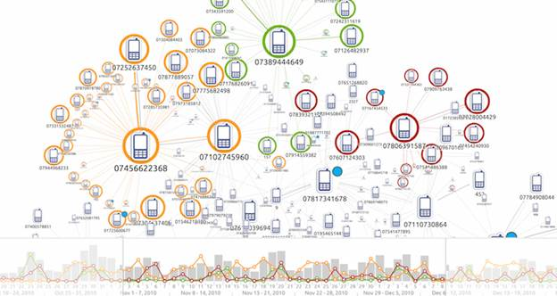<!--[endif]--><o:p></o:p></li>
</ul>

<o:p>&nbsp;</o:p>

<ul type="disc">
 <li class="MsoNormal" style="mso-margin-top-alt:auto;margin-bottom:12.0pt;
     mso-list:l7 level1 lfo7;tab-stops:list .5in">Cytoscape
     (WYSIWG and JavaScript) - Amazing...it is both a standalone analysis
     environment and JavaScript library<o:p></o:p></li>
 <ul type="circle">
  <li class="MsoNormal" style="mso-margin-top-alt:auto;mso-margin-bottom-alt:
      auto;mso-list:l7 level2 lfo7;tab-stops:list 1.0in">JavaScript:&nbsp;<a href="http://js.cytoscape.org/">http://js.cytoscape.org/</a><o:p></o:p></li>
  <li class="MsoNormal" style="mso-margin-top-alt:auto;margin-bottom:12.0pt;
      mso-list:l7 level2 lfo7;tab-stops:list 1.0in">Standalone:<a href="http://www.cytoscape.org/">http://www.cytoscape.org/</a><o:p></o:p></li>
 </ul>
</ul>

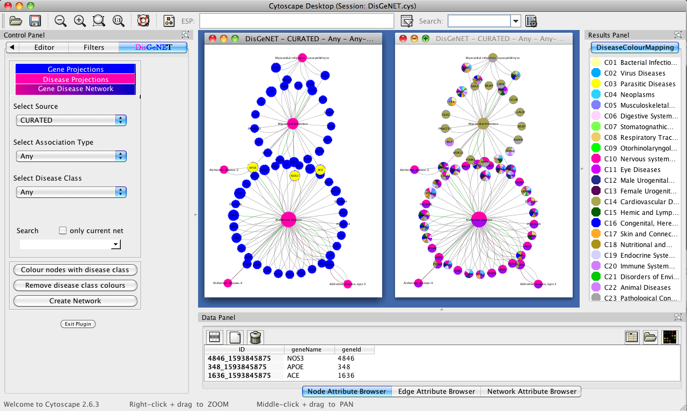<o:p></o:p>

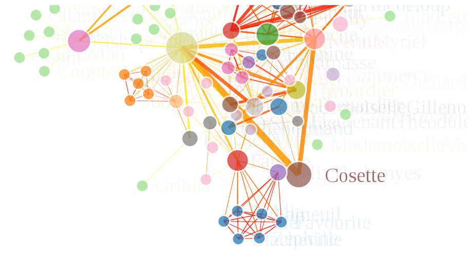<o:p></o:p>

&nbsp;<o:p></o:p>

<ul type="disc">
 <li class="MsoNormal" style="mso-margin-top-alt:auto;mso-margin-bottom-alt:auto;
     mso-list:l1 level1 lfo8;tab-stops:list .5in">sigma.js
     (JavaScript) - The secret sauce behind many visualization libraries.&nbsp;
     Beutiful graphs without a Ph. D. in
     3d.js:&nbsp;&nbsp;<a href="http://sigmajs.org/">http://sigmajs.org/</a> 
      
     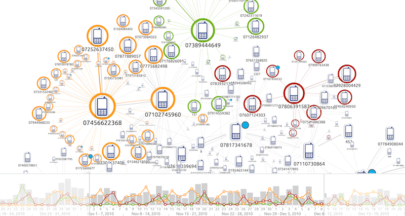<o:p></o:p></li>
</ul>

<h3 id="Hacker&#39;sGuidetoQ&amp;AVisualization-GraphDatabases:">Graph
Databases:<o:p></o:p></h3>

<ul type="disc">
 <li class="MsoNormal" style="mso-margin-top-alt:auto;margin-bottom:12.0pt;
     mso-list:l9 level1 lfo9;tab-stops:list .5in">TinkerPop
     (multiple) - The single most important Graph "stack" to
     date.&nbsp; It's an API and a dtabase and has
     hooks for almost any graph and non-graph database that matter's.&nbsp;
     Lean this API and you have access to a vitually
     unlimited ecosystem of graph analytics tool: 
      
     <a href="https://academy.datastax.com/resources/getting-started-tinkerpop-and-gremlin">https://academy.datastax.com/resources/getting-started-tinkerpop-and-gremlin</a> 
     <a href="http://tinkerpop.apache.org/docs/3.1.0-incubating/tutorials-getting-started.html">http://tinkerpop.apache.org</a><o:p></o:p></li>
 <li class="MsoNormal" style="mso-margin-top-alt:auto;margin-bottom:12.0pt;
     mso-list:l9 level1 lfo9;tab-stops:list .5in">Gremlin
     Servers - TinkerPop's Gremlin has lightweight,
     standalone server that work out of the box:&nbsp;&nbsp;<o:p></o:p></li>
 <ul type="circle">
  <li class="MsoNormal" style="mso-margin-top-alt:auto;mso-margin-bottom-alt:
      auto;mso-list:l9 level2 lfo9;tab-stops:list 1.0in">Gremlin
      Server -&nbsp;<a href="http://tinkerpop.apache.org/docs/current/reference/#gremlin-server">http://tinkerpop.apache.org/docs/current/reference/#gremlin-server</a><o:p></o:p></li>
  <li class="MsoNormal" style="mso-margin-top-alt:auto;mso-margin-bottom-alt:
      auto;mso-list:l9 level2 lfo9;tab-stops:list 1.0in">TinkerGraph
      -&nbsp;<a href="http://tinkerpop.apache.org/docs/current/reference/#tinkergraph-gremlin">http://tinkerpop.apache.org/docs/current/reference/#tinkergraph-gremlin</a><o:p></o:p></li>
 </ul>
</ul>

<a href="http://tinkerpop.apache.org/docs/current/reference/#gremlin-server"> 
</a>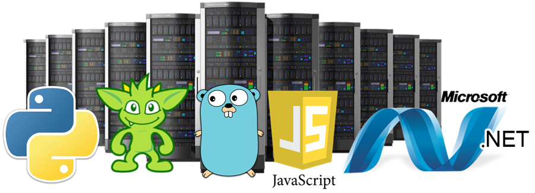 
<a href="http://tinkerpop.apache.org/docs/current/reference/#gremlin-server"> 
</a><o:p></o:p>

<ul type="disc">
 <li class="MsoNormal" style="mso-margin-top-alt:auto;margin-bottom:12.0pt;
     mso-list:l4 level1 lfo10;tab-stops:list .5in">neo4j -
     Neo4j is a commercial product but the community edition is useful for
     prototyping and it is an all in one database, visualization and wrangling
     setup:&nbsp; &nbsp;<a href="https://neo4j.com/download/">https://neo4j.com/download/</a> 
      
     You'll have to learn the Cypher Query language but it's not that hard to
     pick up:&nbsp;&nbsp;<a href="https://neo4j.com/developer/cypher-query-language/">https://neo4j.com/developer/cypher-query-language/</a> 
      
     Some inspiration:&nbsp;<a href="https://offshoreleaks.icij.org/#_ga=2.228660124.1057063318.1507812556-1860127475.1507812556">https://offshoreleaks.icij.org/#_ga=2.228660124.1057063318.1507812556-1860127475.1507812556</a> 
      
     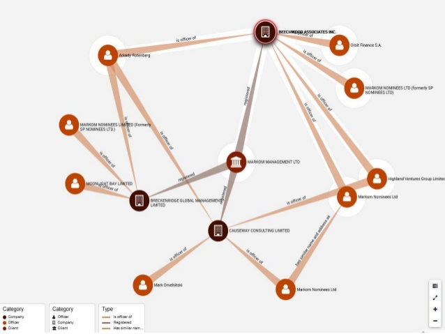<o:p></o:p></li>
 <li class="MsoNormal" style="mso-margin-top-alt:auto;mso-margin-bottom-alt:auto;
     mso-list:l4 level1 lfo10;tab-stops:list .5in">ElasticSearch
     / Kibana / X-Pack - ElasticsSearch and Kibana
     are open source, X-Pack is not (for production use).&nbsp; Nevertheless,
     it is an extremely powerful and scalable solution:<o:p></o:p></li>
</ul>

<a href="https://www.elastic.co/guide/en/kibana/5.6/xpack-graph.html">https://www.elastic.co/guide/en/kibana/5.6/xpack-graph.html</a><o:p></o:p>

<a href="https://www.elastic.co/downloads">https://www.elastic.co/downloads</a><o:p></o:p>

<a href="https://www.elastic.co/downloads/x-pack">https://www.elastic.co/downloads/x-pack</a><o:p></o:p>

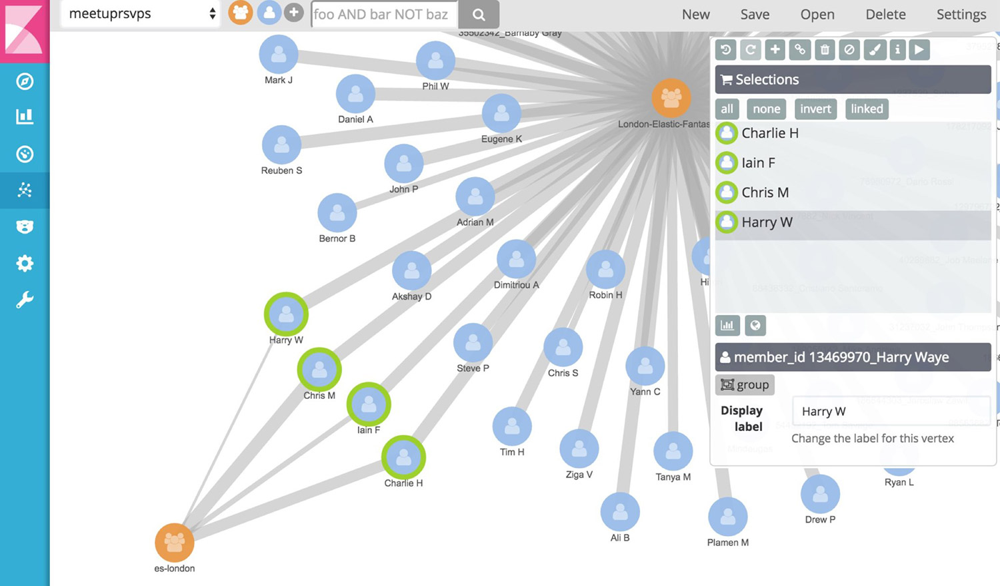<o:p></o:p>

<!--[if !supportLists]-->·&nbsp;&nbsp;&nbsp;&nbsp;&nbsp;&nbsp;&nbsp;&nbsp;
<!--[endif]-->JanusGraph
- Titan DB is dead, long live JanusGraph:&nbsp;&nbsp;<a href="http://janusgraph.org/">http://janusgraph.org/</a>&nbsp;(Warning:
industrial strength and a bit of a learning curve but worth it...true OSS, full
text search, structured queries, graph queries...incredible)<o:p></o:p>

<o:p></o:p>

<ul type="disc">
 <li class="MsoNormal" style="mso-margin-top-alt:auto;mso-margin-bottom-alt:auto;
     mso-list:l4 level1 lfo10;tab-stops:list .5in">ArangoDB
     - Another powerful Graph DB&nbsp;<a href="https://www.arangodb.com/">https://www.arangodb.com/</a> 
      
     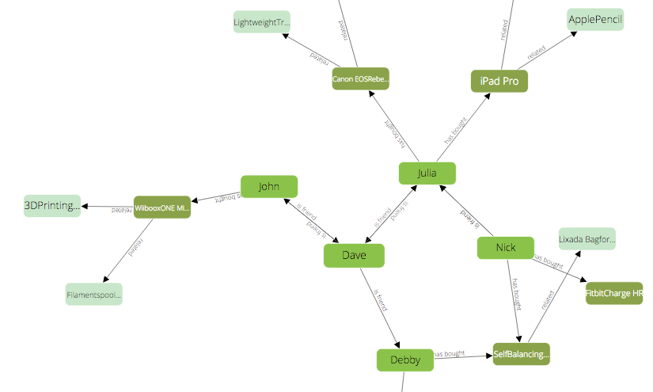<o:p></o:p></li>
</ul>

&nbsp;<o:p></o:p>

&nbsp;<o:p></o:p>

&nbsp;<o:p></o:p>

</body></html>
